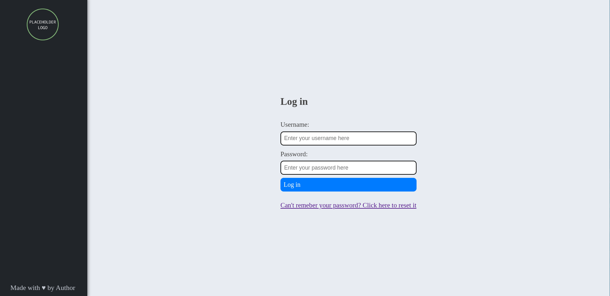

# django-robust-template
A simple django project template that I believe is a good starting point
for a project that is a small/medium internal tools (e.g a dashboard used by your department).
This template includes:
 - boilerplate for django password authentication
 - boilerplate for configuring django error pages
 - boilerplate for [django-jazzmin](https://django-jazzmin.readthedocs.io/) configuration
 - [Github Actions](https://docs.github.com/en/actions) for running tests
 using [pytest](https://docs.pytest.org/en/stable/), type checking using [mypy](https://www.mypy-lang.org/), linting with [ruff](https://docs.astral.sh/ruff/) checking whether the program's version
 was bumped
 - a starting point for the UI
 - a Docker image definition that runs the application via [bjoern](https://github.com/jonashaag/bjoern)
 - most of [django settings](https://docs.djangoproject.com/en/5.2/ref/settings/) you'd like to define via environment
 variables exposed
 - [Whitenoise](https://whitenoise.readthedocs.io/en/latest/) for django configured
 - sqlite configured such that the datestimes are stored in the correct timezone

# Usage
I believe that it's best to fork this repository and modify the template slightly
to your liking. You can also use this repository as a template as such:

```bash
PROJECT_NAME="<INSERT YOUR PROJECT NAME HERE>"
PROJECT_DESCRIPTION="<INSERT A SHORT PROJECT DESCRIPTION HERE>"
MAINTAINER_EMAIL="<INSERT THE PROJECT'S MAINTAINER EMAIL HERE>"
COMPANY_DOMAIN="<INSERT THE EMAIL DOMAIN OF YOUR COMPANY HERE>"
COMPANY_NAME="<INSERT YOUR COMPANY NAME HERE>"

python -m venv venv \
    && source venv/bin/activate \
    && pip install django django-jazzmin whitenoise pytest pytest-django pytest-xdist coverage mypy django-stubs ruff bjoern \
    && pip freeze > requirements.txt

django-admin startproject --template "https://github.com/jacadzaca/django-robust-template/archive/refs/heads/master.zip" --name "Dockerfile" --name "pyproject.toml"  --name "CHANGELOG.md" --exclude ".git" --name "README.md" "${PROJECT_NAME}" .

sed -ie "s/{{ project_name }}/$PROJECT_NAME/g" .github/workflows/check_version_bumped.yml
sed -ie "s/{{ project_name }}/$PROJECT_NAME/g" .github/workflows/check_enviroment_variables_included_in_readme.yml
sed -ie "s/Your application's description/$PROJECT_DESCRIPTION/g" Dockerfile
sed -ie "s/Your company/$COMPANY_NAME/g" Dockerfile
sed -ie "s/your.email@example.com/$MAINTAINER_EMAIL/g" Dockerfile
sed -ie "s/project_name/$PROJECT_NAME/g" templates/base.html
sed -ie "s/your.name@example.com/MAINTAINER_EMAIL/g" $PROJECT_NAME/settings.py
sed -ie "s/example.com/COMPANY_DOMAIN/g" $PROJECT_NAME/settings.py
```

or using PowerShell:

```pwershell
$PROJECT_NAME = "<INSERT YOUR PROJECT NAME HERE>"
$PROJECT_DESCRIPTION = "<INSERT A SHORT PROJECT DESCRIPTION HERE>"
$MAINTAINER_EMAIL = "<INSERT THE PROJECT'S MAINTAINER EMAIL HERE>"
$COMPANY_DOMAIN = "<INSERT THE EMAIL DOMAIN OF YOUR COMPANY HERE>"
$COMPANY_NAME = "<INSERT YOUR COMPANY NAME HERE>"

python -m venv venv
& "venv/Scripts/Activate.ps1"

pip install django django-jazzmin whitenoise pytest pytest-django pytest-xdist coverage mypy django-stubs ruff bjoern

pip freeze > requirements.txt

django-admin startproject --template "https://github.com/jacadzaca/django-robust-template/archive/refs/heads/master.zip" `
    --name "Dockerfile" `
    --name "pyproject.toml" `
    --name "CHANGELOG.md" `
    --name "README.md" `
    --exclude ".git" `
    $PROJECT_NAME .

(gc ".github/workflows/check_version_bumped.yml") -replace "{{ project_name }}", $PROJECT_NAME | Set-Content ".github/workflows/check_version_bumped.yml"
(gc "Dockerfile") -replace "Your application's description", $PROJECT_DESCRIPTION `
                 -replace "Your company", $COMPANY_NAME `
                 -replace "your.email@example.com", $MAINTAINER_EMAIL | Set-Content "Dockerfile"
(gc "templates/base.html") -replace "project_name", $PROJECT_NAME | Set-Content "templates/base.html"
(gc "$PROJECT_NAME/settings.py") -replace "your.name@example.com", $MAINTAINER_EMAIL `
                                  -replace "example.com", $COMPANY_DOMAIN | Set-Content "$PROJECT_NAME/settings.py"
```


# Explanation of environment variables
| Variable name           | Goal                                                                             | What happens if empty?                                      | Default value                                                    |
|-------------------------|----------------------------------------------------------------------------------|-------------------------------------------------------------|------------------------------------------------------------------|
| SECRET_KEY              | signing sessions, cookies etc                                                    | the application is started in DEBUG mode with a default key | `openssl rand -base64 30`                                        |
| PORT                    | port on which the application is to listen                                       | default value is used                                       | `8080`                                                           |
| DOMAIN                  | easy including of images, links etc. in the emails                               | default value is used                                       | `127.0.0.1:{PORT}`                                               |
| TZ                      | specifying the applications timezone                                             |                                                             | `UTC`                                                            |
| EMAIL_USE_TLS           | specifying whether to send emails using TLS                                      | default value is used                                       | `False`                                                          |
| EMAIL_HOST              | specifying the host of the SMTP server’s                                         | emails are stored in files instead of being sent            | N/A                                                              |
| EMAIL_PORT              | specifying the SMTP server’s port                                                | default value is used                                       | `26`                                                             |
| EMAIL_HOST_USER         | specifying the SMTP server user                                                  | default value is used                                       | N/A                                                              |
| EMAIL_HOST_PASSWORD     | specifying the SMTP server user’s password                                       | default value is used                                       | N/A                                                              |
| DEFAULT_FROM_EMAIL      | specifying the default email from which the application sends message            | default value is used                                       | `{{ project_name\|title }}Bot <{{ project_name }}@domain.com`    |
| SERVER_EMAIL            | specifying the default email from which the applications send emails with errors | default value is used                                       | `{{ project_name\|title }}Errors <{{ project_name }}@domain.com` |
| DJANGO_LOCALE           | specifying the applications language                                             | default value is used                                       | `en-us`                                                          |
| USE_THOUSAND_SEPARATOR  | specifying whether to use a thousand separator                                   | default value is used                                       | `True`                                                           |
| STATIC_ROOT             | specifying the folder with static files when DEBUG is False                      | default value is used                                       | `/var/www/{{ project_name }}/static`                             |

# Default design



